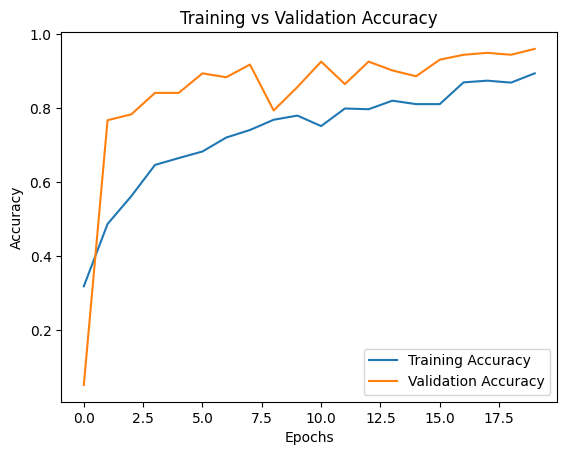
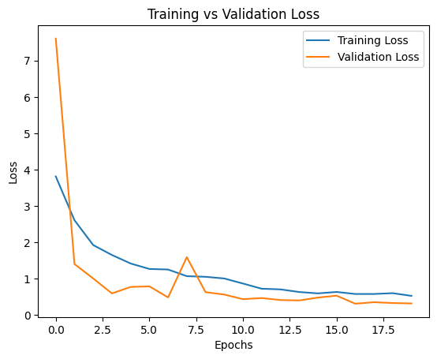

# README: Training and Preprocessing Audio Data with TensorFlow

This document provides an overview of how to preprocess audio files, train a model using TensorFlow, and predict audio classes. 

---

## 1. Preprocessing Audio Data

Before training, the raw audio data needs to be processed to ensure uniformity and compatibility with the model. Here's how the preprocessing works:

### **Input**
Audio files located in a folder named `raw_data`.

### **Processing Steps**
1. **Merge Files**:
   - If audio files have similar names (e.g., `file_1.wav` and `file_2.wav`), they are merged.
   - The merged file is saved with the common prefix (e.g., `file`).
   
2. **Standardization**:
   - Set sample width to **16 bits (2 bytes)**.
   - Resample the audio to **48 kHz**.
   - Convert all audio to **mono** (single channel).
   
3. **Silence Removal**:
   - Split the audio on silent segments (minimum silence length: **3 seconds**, silence threshold: **-40 dB**).
   
4. **Chunking**:
   - Break audio into 1-second chunks (or longer).
   - Export chunks as WAV files into a folder structure under `final_data`.

### **Output**
Processed audio chunks saved in subfolders, ready for training.

---

## 2. Training the Model

Using the preprocessed audio data, a deep learning model is trained. 

### **Loading Data**
- Use TensorFlow's `audio_dataset_from_directory` to load audio files from `final_data`.
- Split the dataset into training (80%) and validation (20%).
- Each audio file is converted into sequences of length **48,000 samples**.

### **Model Architecture**
A **1D Convolutional Neural Network (CNN)** with the following layers:
- **Conv1D**: For extracting local temporal patterns from the audio.
- **BatchNormalization**: To stabilize training.
- **MaxPooling1D**: For down-sampling.
- **Dropout**: For regularization and avoiding overfitting.
- **GlobalAveragePooling1D**: To reduce feature maps into a single vector.
- **Dense Layers**: Fully connected layers with L2 regularization and `ReLU` activation.
- **Softmax Output**: For classifying into 16 distinct classes.

### **Optimizer and Loss**
- **Optimizer**: Adam with learning rate decay.
- **Loss Function**: Categorical cross-entropy.

### **Training Parameters**
- **Early Stopping**: Stops training if validation loss doesn't improve for 5 epochs.
- **Learning Rate Reduction**: Reduces the learning rate if validation loss plateaus for 3 epochs.
- **Epochs**: 20.

---

## 3. Model Evaluation

### **Metrics During Training**
- The accuracy and loss are plotted for training and validation sets.
  

  
- Metrics for the final epoch are printed, including:

 | Epoch | Train Accuracy | Validation Accuracy | Train Loss | Validation Loss |
 |-------|----------------|---------------------|------------|-----------------|
 |  20   | 0.88           | 0.97                | 0.57       | 0.32            |
 


### **Confusion Matrix**
A confusion matrix is generated for the validation set to visualize class predictions.

  

---

## 4. Predicting Audio Classes

A custom function is provided to make predictions on new audio files.

### **Steps**
1. Convert the audio file into a WAV format if it's not already.
2. Load and preprocess the audio (pad/truncate to 48,000 samples).
3. Pass the audio to the trained model to predict its class.

### **Example Usage**
```python
audio_path = "example_audio.wav"  # Path to the audio file
predicted_class = predict_audio(audio_path)
print(f"Predicted class: {predicted_class}")
```

## How to Run the Code
1. Clone the repository:

```
https://github.com/nakhani/Deep-Learning/tree/36cbf0bfdde41f52ad7e280daeb066b274f1d2a1/Audio%20Classification/classmate%20version

```

2. Navigate to the directory:

```
   Introduction to classmate version
```

4. Run the assignments:
  
```
jupyter notebook preprocessing.ipynb  # For preprocessing the audio files
jupyter notebook model.ipynb          # For training the audio classification model
```

## Technologies Used
- Python 3
- TensorFlow/Keras
- NumPy
- Matplotlib
- pydub
- scikit-learn
