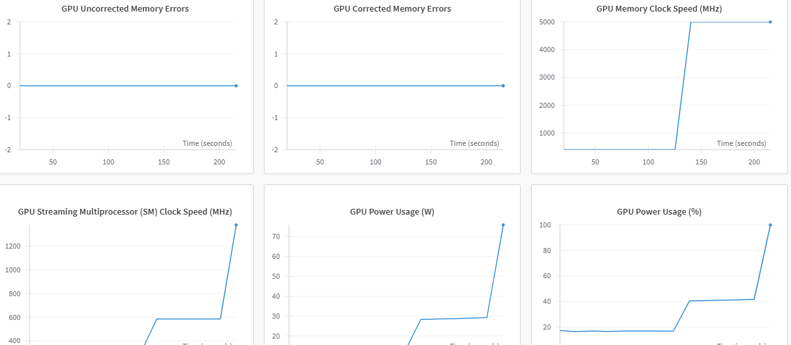
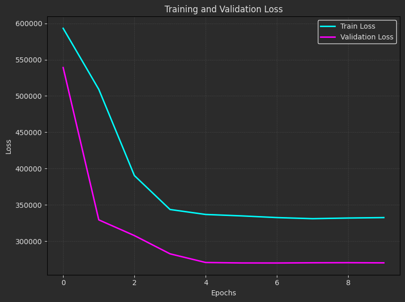

# Deep Learning and Regression 

This repository contains two deep learning projects using **TensorFlow/Keras**:

1. **Age Prediction** 👶🏻👵🏻: Train a CNN-based regression model on the **UTKFace dataset** to predict a person's age from facial images.
2. **Home Price Prediction** 🏠💰: Train a CNN-based regression model using multiple house images to predict home prices.

---

## Project 1: Age Prediction 👶🏻👵🏻

The goal of this project is to predict the **age** of a person using the **UTKFace dataset**, which contains **23,000 aligned facial images** with age labels.

### Steps
1. **Dataset Preparation**: 
- Download the UTKFace dataset from **Kaggle**.
- Load and analyze the **23,000 images**, removing corrupted or unnecessary samples.

2. **Data Augmentation**: 
- Apply **horizontal flipping** to improve model generalization.

3. **Model Training**: 
- Utilize **Transfer Learning** with a pretrained **CNN** (**ResNet50**).
- **Freeze layers** to retain pre-learned features.
- Add **Dropout layers** to prevent overfitting.
- Train the model using **Mean Absolute Error (MAE)** as the loss function.


4. **Evaluation**: 
- **Loss Curve Analysis**: Track **MAE** during training.
   
     

- **Sample Inference**: Predict ages on test images.

- **Evaluation Table**:

     | **Metric**       | **Training** | **Validation** |
     |-------------------|--------------|----------------|
     | **Loss**          | 0.1979       | 0.1952        |

     These evaluation metrics provide a detailed view of the model's overall performance during training and validation phases.

5. **WandB Integration**:  
- The training process is connected to **Weights & Biases (WandB)** for tracking and evaluation.
     
     

6. **Inference**:
- Load a **person’s face image**.
- Preprocess the image.
- Pass it through the trained model to predict age.

---

## Project 2: Home Prices Prediction 🏠💰

This project builds a deep learning regression model using **multiple images per home** to estimate property prices.

### Steps
1. **Dataset Preparation**: 
- Use the dataset structure from **PyImageSearch** to process home images.
- Each home consists of **4 images**:
  - **Bedroom**
  - **Frontal View**
  - **Kitchen**
  - **Living Room**
- Labels correspond to **property prices**.


2. **Model Architecture**: 

- Use **EfficientNetB0** for feature extraction.
- Process each image **independently** before merging representations.
- Fully connected layers output the **predicted price**.

3. **Training**:

- Use **Mean Absolute Error (MAE)** as the loss function.
- Apply **Dropout layers** for regularization.
- Fine-tune learning rates for better accuracy.

4. **Evaluation**: 
- Generate a **loss** curve.

   

- Perform inference with test images.
- **Evaluation Table**:

  | **Metric**       | **Training** | **Validation** | 
  |-------------------|--------------|----------------|
  | **Loss**          | 330264.1875       | 270031.0625         | 

  These evaluation metrics provide a detailed view of the model's overall performance during training and validation phases.

4. **Inference**:
- Provide **4 images** of a home to the trained model.
- Predict and display the estimated house price.

---

## How to Run the Code
1. Clone the repository:

   ```
   https://github.com/nakhani/Deep-Learning/tree/d207f0d7c03b5aae34a04a8b97d09192f120afc1/CNN_Regression
   ```

2. Navigate to the directory:

   ```
   CNN_Regression
   ```

3. Install the required packages:
   ```sh
   pip install -r requirements.txt
   ```

4. Run the project:
  
   ```
   jupyter notebook age_prediction.ipynb  # For training UTKFace Dataset model and predict an person's age with Transfer Learning and CNN Regression
   jupyter notebook house_price_prediction.ipynb    # For training Houses Info Dataset model and predict a new house's price flower with Transfer Learning and CNN Regression
   ```
   
---
## Technologies Used
- Python 3
- TensorFlow/Keras
- NumPy
- Pandas
- Matplotlib
- scikit-learn
- Weights & Biases (wandb) for logging