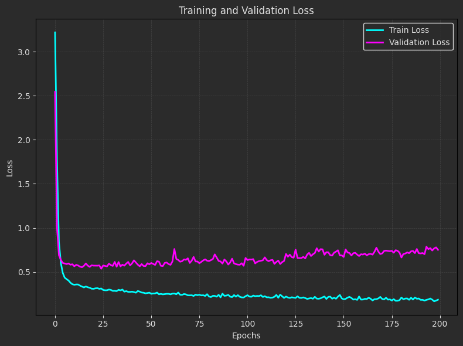
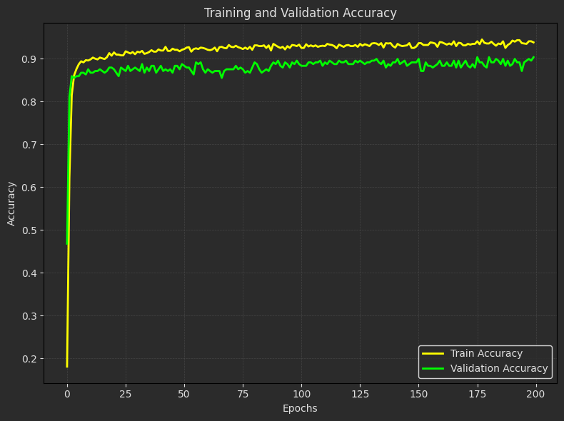

# Facial Recognition Using MLP Neural Network

This project uses a Multi-Layer Perceptron (MLP) neural network to classify images from the PersianFace dataset. 

---

## Preprocessing Data
The preprocessing step involves converting images into feature vectors using the DeepFace library with the ArcFace model. This step is crucial for preparing the dataset for training a neural network.

### Explanation
#### **Input Folder:**

- The input_folder contains subfolders, each representing a label (e.g., actor names).

- Each subfolder contains images of the corresponding label.

#### **Feature Extraction:**

- The DeepFace.represent function extracts feature vectors (embeddings) from images using the ArcFace model.

#### **Dataset Creation:**

- The extracted features are combined with labels and file names to create a structured dataset.

- The dataset is saved as a CSV file (combined_dataset.csv).

## Train Model Using MLP

### Dataset
- The dataset contains feature vectors extracted using the DeepFace library with the ArcFace model.
- Split: 70% training, 15% validation, 15% test.

### Model
- **Architecture**:
  - Input layer: Accepts feature vectors.
  - Hidden layers: Dense layers with ReLU activation and dropout for regularization.
  - Output layer: Softmax for multi-class classification.
- **Optimizer**: Adam.
- **Loss function**: Sparse Categorical Crossentropy.
- **Metrics**: Accuracy.
---


## Model Evaluation

- The accuracy and loss are plotted for training and validation sets:

  

  


- Evaluated Table:

  | Metric              | Value        |
  |----------------------|--------------|
  | Training Accuracy    | **0.93** |
  | Validation Accuracy  | **0.90** |
  | Test Accuracy        | **0.90** |
  | Test Loss            | **0.42** |
 

---

# Important Notice for Prediction ⚠️

To ensure compatibility between **TensorFlow** and the **DeepFace** library during the prediction phase, it is critical to use the specified versions of these libraries. Failing to install the correct versions may result in synchronization issues or runtime errors.

### Setup Instructions:

Run the following commands to set up the necessary library versions:

```bash
!pip install --upgrade deepface
!pip install tensorflow==2.12.0
```

### Default Setup Requirements:
- DeepFace: Latest version (install/upgrade as shown above).
- TensorFlow: Version 2.12.0 (other versions might cause compatibility issues).

---

## How to Run the Code
1. Clone the repository:

   ```
   https://github.com/nakhani/Deep-Learning/tree/cae1786a1cf596db0fddf738a728c07e9f306f32/Face%20recognition
   ```

2. Navigate to the directory:

   ```
   Face recognition
   ```

3. Install the required packages:
   ```sh
   pip install -r requirements.txt
   ```

4. Run the project:
  
   ```
   jupyter notebook convert_dataset.ipynb  # For preprocessing the persian actor dataset
   jupyter notebook persian_actor.ipynb    # For training model and predict a new actor
   ```

---
## Technologies Used
- Python 3
- TensorFlow/Keras
- NumPy
- Pandas
- Matplotlib
- Deepface
- scikit-learn
