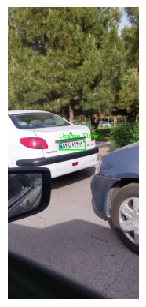

# 🚘 Persian License Plate Recognition Using YOLOv8

## 📌 Project Overview
This project implements **YOLOv8** to **detect and crop Persian license plates** from images. It uses **Roboflow** for dataset management, **Ultralytics YOLOv8** for training, and **OpenCV** for image processing.

---

## 🛠️ Key Components

### 🔹 Dataset Preparation
- Utilizes **Roboflow API** to download pre-labeled Persian license plate images.  
- Covers various types of plates, including **private, taxi, police, and wheelchair plates**.  
- Labels are formatted for **YOLOv8 training**.  

### 🔹 Model Training
- **YOLOv8** is trained using **50 epochs**, optimizing bounding box detection accuracy.  
- The model is **exported in ONNX format**, ensuring compatibility with various deployment environments.  
- Uses **Ultralytics’ built-in training functions** for efficient training.  

### 🔹 Inference & Plate Cropping
- The trained **YOLOv8 model** detects license plates in images.  
- **OpenCV** is used to:  
  ✅ Draw bounding boxes on the image.  
  ✅ Crop the detected license plate.  
  ✅ Save the cropped image for further processing.  

### 🔹 Image Visualization
- The script **displays the detected license plate** with bounding boxes.  
- The **cropped plate** is saved separately for further processing.  

---

## 📷 Inference Result

### **Detected Image with Bounding Box**
 
.png) 

### **Cropped License Plate**
.png) 
.png) 
---

## How to Run the Code
1. Clone the repository:

   ```
   https://github.com/nakhani/Deep-Learning/tree/1b3cd18c66cd0a9819b0adcd93cc19f456dfca5b/Object_Detection
   ```

2. Navigate to the directory:

   ```
   Object_Detection
   ```

3. Instal the required packages:
   ```sh
   pip install -r requirements.txt
   ```

4. Run the project:
  
   ```
   jupyter notebook plate_detection.ipynb  # For training persian license plates Dataset model and predict a new persian license plates with YOLO

   ```
   
---
## Technologies Used
- Python 3
- Ultralytics
- NumPy
- Roboflow
- Matplotlib

