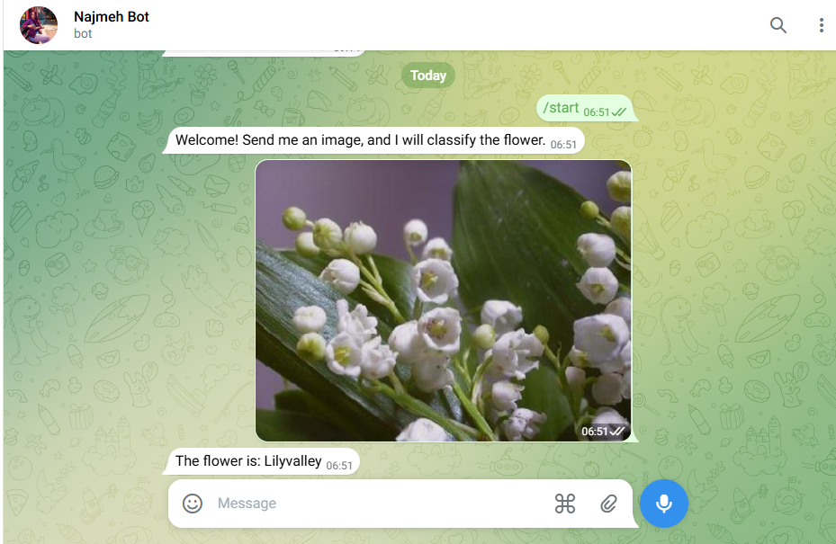
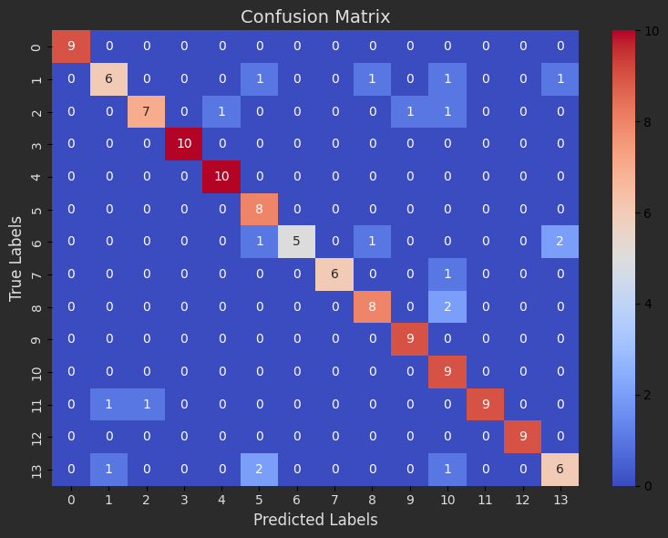
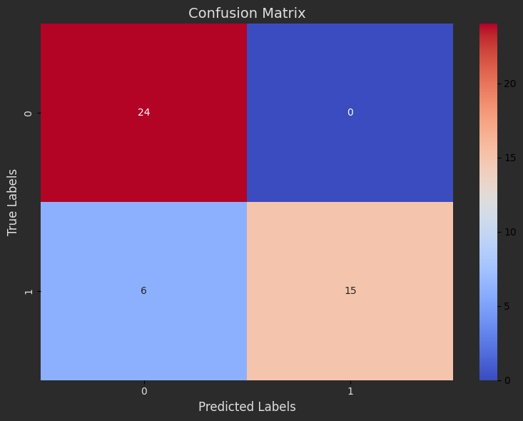
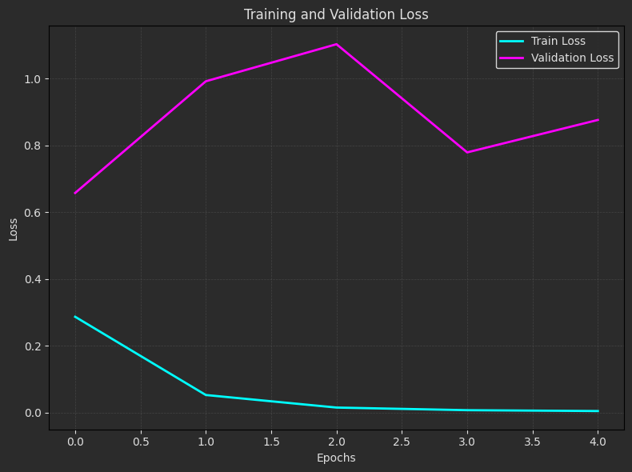
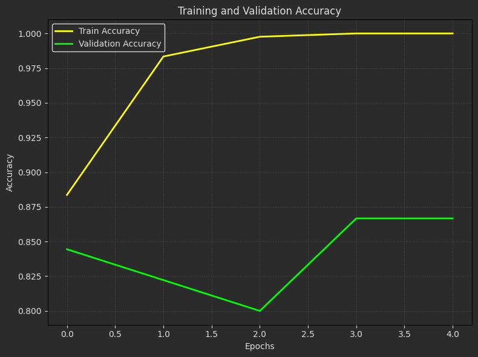
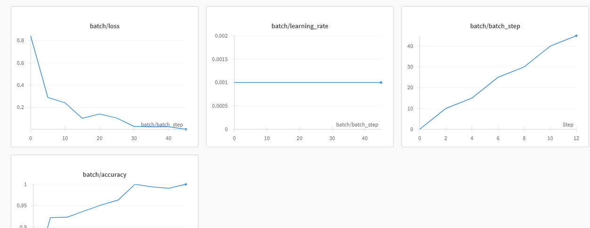
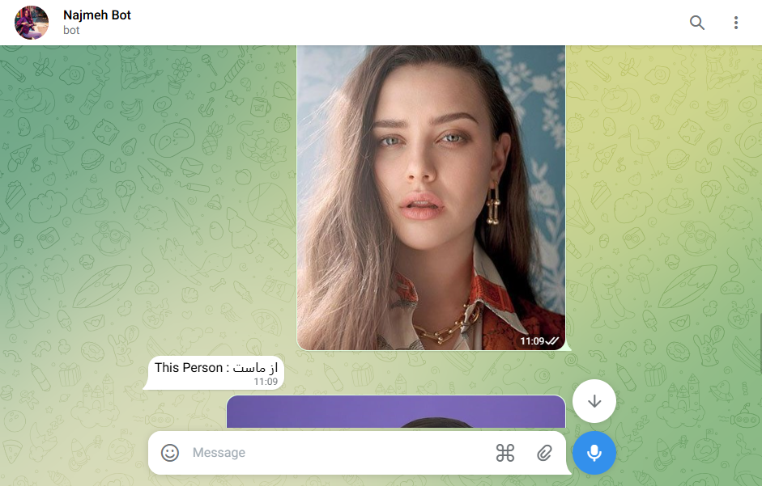
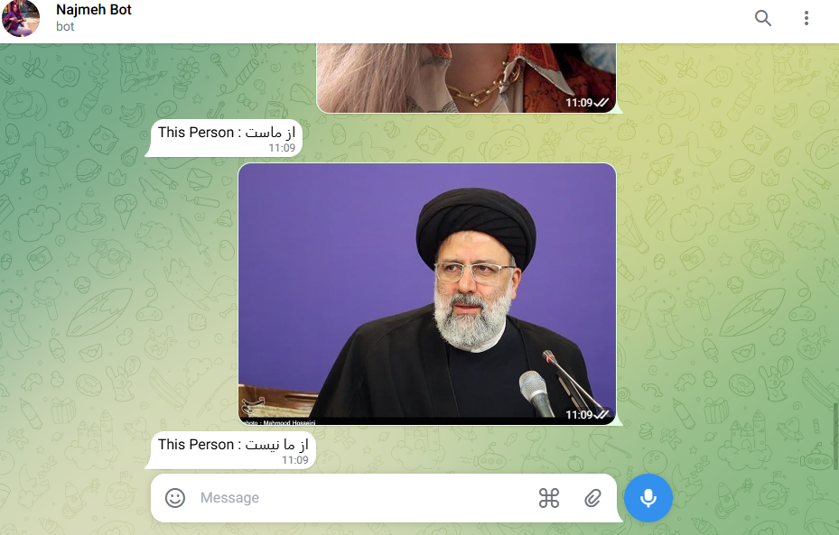

# Transfer Learning and Image Classification

This repository implements image classification using Convolutional Neural Networks (CNNs) with transfer learning. It supports multiple datasets and includes features such as face alignment, data augmentation, model freezing, dropout layers, and integration with WandB and Telegram bots.

1. **5 Animals Classification**: Train a MobileNetV2 model on a custom dataset to classify animals and produce the name's animal predictions.
2. **17 Flowers Classification**: Train and evaluate a MobileNetV2 model on flower species, including data augmentation and integration with a Telegram bot.
3. **7_7 Face Classification**: Train a MobileNetV2 model on a custom dataset to classify faces and produce the name's person predictions.
4. **Akhund and Human Classification**: Train a MobileNetV2 model on Akhund and Human Dataset, including data augmentation and integration with a Telegram bot.


## Project 1: 5 Animals Classification

The goal of this project is to classify images from the **5 Animals** dataset. A Convolutional Neural Network (CNN) with Transfer Learning `MobileNetV2` model is trained to achieve high accuracy, and inference produces the name of corresponding to the animal classes.

### Steps
1. **Dataset**: The dataset contains 1,314 images organized into 5 folders, each corresponding to a specific animal category: `cat, dog, elephant, panda, and giraffe`. These images are carefully curated to ensure diversity within each class, making the dataset suitable for machine learning tasks such as classification, image recognition, or transfer learning.
2. **Model Training**: Trained a CNN and MobileNetV2 model using `TensorFlow/Keras` with a sequential architecture to classify images into five animal categories (cat, dog, elephant, panda, and giraffe). Below is the summary of the model:

- **Model**: "sequential"

  | **Layer (type)**      | **Output Shape**     | **Param #**    |
  |-----------------------|----------------------|----------------|
  | mobilenetv2_1.00_224 (Functional)      | (None, 1280) | 2,257,984           |
  | flatten_4 (Flatten)     | (None, 1280)| 0         |
  |      dropout_5 (Dropout)    | (None, 1280)| 0              |
  | dense_6 (Dense)     | (None, 5)      | 6,405              |


- **Total params**: 3,101,521 (11.83 MB)  
- **Trainable params**: 418,565 (1.60 MB)  
- **Non-trainable params**: 1,845,824 (7.04 MB)

3. **Evaluation**: 
- **Confusion Matrix**:
Visualize the **confusion matrix** to assess model performance and identify classification results. The confusion matrix helps to understand where misclassifications occur and how well the model predicts each class.

   

- **Train and Validation Plots**:
Analyze the training process through plots of:
- **Loss**: Track the training and validation loss across epochs to identify convergence and overfitting issues.

   

- **Accuracy**: Visualize training and validation accuracy over epochs to measure the model's performance and generalization.

    

- **Evaluation Table**:

  | **Metric**       | **Training** | **Validation** |
  |-------------------|--------------|----------------|
  | **MobileNetV2 Accuracy**      | **99.67%**       | **99.24%**         |
  | **MobileNetV2 Loss**          | **0.0152**       | **0.0295**         |
  | **Custom Model Accuracy**      | 90.15%       | 63.74%         |
  | **Custom Model Loss**          | 0.2688       | 1.1628         |

  These evaluation metrics provide a detailed view of the model's overall performance during training and validation phases.

4. **Inference**:
   - Read an image.
   - Predict its class.
   - Print the corresponding animal.

---

## Project 2: 17 Flowers Classification

The goal of this project is to classify images from the **17Flowers** dataset. A Convolutional Neural Network (CNN) with Transfer Learning `MobileNetV2` model is trained to achieve high accuracy, augmented to improve performance, and connected to a Telegram bot for inference.

### Steps
1. **Dataset**: The dataset consists of 17 classes of flowers, with a total of 1020 training images and 340 test images. Each class represents a unique flower type, including: `bluebell, buttercup, coltsfoot, cowslip, crocus, daffodil, daisy, dandelion, fritillary, iris, lilyvalley, pansy, snowdrop, sunflower, tigerlily, tulip, windflower`. These images are carefully organized and balanced across all classes, ensuring diversity and reliability for machine learning tasks such as classification, image recognition, or transfer learning.

2. **Model Training**: Trained a CNN and MobileNetV2 model using `TensorFlow/Keras` with a sequential architecture to classify images into five animal categories (bluebell, buttercup, coltsfoot, cowslip, crocus, daffodil, daisy, dandelion, fritillary, iris, lilyvalley, pansy, snowdrop, sunflower, tigerlily, tulip, windflower). Below is the summary of the model:

- **Model**: "sequential"

  | **Layer (type)**      | **Output Shape**     | **Param #**    |
  |-----------------------|----------------------|----------------|
  | mobilenetv2_1.00_224 (Functional)      | (None, 1280) | 2,257,984           |
  | flatten_6 (Flatten)     | (None, 1280)| 0         |
  |      dropout_7 (Dropout)    | (None, 1280)| 0              |
  | dense_8 (Dense)     | (None, 17)      | 21,777              |

- **Total params**: 3,147,637 (12.01 MB) 
- **Trainable params**: 433,937 (1.66 MB)  
- **Non-trainable params**: 1,845,824 (7.04 MB)

3. **Evaluation**: 
- **Confusion Matrix**:
Visualize the **confusion matrix** to assess model performance and identify classification results. The confusion matrix helps to understand where misclassifications occur and how well the model predicts each class.

   

- **Train and Validation Plots**:
Analyze the training process through plots of:
- **Loss**: Track the training and validation loss across epochs to identify convergence and overfitting issues.

    

- **Accuracy**: Visualize training and validation accuracy over epochs to measure the model's performance and generalization.

   

- **Evaluation Table**:

  | **Metric**       | **Training** | **Validation** | **Test** |
  |-------------------|--------------|----------------|---------|
  | **MobileNetV2 Accuracy**      | **96.30%**       | **88.32%**         | **87.94%** |
  | **MobileNetV2 Loss**          | **0.1192**       | **0.4706**         | **0.4429** |
  | **Custom Model Accuracy**      | 73.66%        | 59.39%         |62.64%  |
  | **Custom Model Loss**          | 0.8033       | 1.2250         |1.221   |


  These evaluation metrics provide a detailed view of the model's overall performance during training and validation phases.

4. **Inference**:
   - Read an image.
   - Predict its class.
   - Print the corresponding animal.

5. **Telegram Bot Integration**:
   - Connect the trained model to a Telegram bot for inference. Users can send an image, and the bot will classify it into one of the 17 flower categories.


      


## Project 3: 7_7 Face Classification

The goal of this project is to classify images from the **7-7 Faces** dataset. A Convolutional Neural Network (CNN) with Transfer Learning `MobileNetV2` model is trained using **Transfer Learning** to achieve high accuracy, and inference predicts and prints the corresponding face class.

### Steps
1. **Dataset**: The dataset consists of **1,358 images** organized into **14 classes**, each representing different human faces. The dataset is stored on **Google Drive** and contains diverse samples to enhance model generalization.

2. **Model Training**: The CNN is trained using **TensorFlow/Keras** with Transfer Learning to classify images into 14 facial categories. Below is a summary of the model:

- **Model**: "sequential"

  | **Layer (type)**      | **Output Shape**     | **Param #**    |
  |-----------------------|----------------------|----------------|
  | mobilenetv2_1.00_224 (Functional)       | (None, 1280)| 2,257,984 |
  | dropout_1 (Dropout)     | (None, 1280)| 0         |
  | dense_1 (Dense)         | (None, 14) | 17,934             |
  

- **Total params**: 2,706,014 (10.32 MB) 
- **Trainable params**: 430,094 (1.64 MB)  
- **Non-trainable params**: 1,845,824 (7.04 MB)

3. **Evaluation**: 
- **Confusion Matrix**:
Visualize the **confusion matrix** to assess model performance and identify classification results. The confusion matrix helps to understand where misclassifications occur and how well the model predicts each class.

   

- **Train and Validation Plots**:
Analyze the training process through plots of:
- **Loss**: Track the training and validation loss across epochs to identify convergence and overfitting issues.

   

- **Accuracy**: Visualize training and validation accuracy over epochs to measure the model's performance and generalization.

   

- **Evaluation Table**:

  | **Metric**       | **Training** | **Validation** |
  |-------------------|--------------|----------------|
  | **Accuracy**      | 100.0%       | 85.50%         |
  | **Loss**          | 0.0038       | 0.6892         |

  These evaluation metrics provide a detailed view of the model's overall performance during training and validation phases.

4. **Inference**:
   - Read an image.
   - Predict its class.
   - Print the corresponding animal.

---

## Project 4: Akhund and Human Classification

The goal of this project is to classify images from the **Akhund-and-Human** dataset using a **Convolutional Neural Network (CNN) with Transfer Learning**. The trained model will predict whether an image belongs to one of the two classes and integrate with a **Telegram bot** for real-time classification.

### Steps
1. **Dataset**: The dataset consists of **2 classes**: **Akhund** and **Human**. Faces are aligned using a **face alignment tool**, e.g., [Face-Alignment](https://github.com/SajjadAemmi/Face-Alignment) and are carefully organized and balanced across all classes, ensuring diversity and reliability for machine learning tasks such as classification, image recognition, or transfer learning.

2. **Model Training**: 

   - **Transfer Learning** is applied for efficient feature extraction.
   - **Data Augmentation** is used to improve model generalization.
   - Some layers are **frozen** to retain pretrained knowledge.
   - **Dropout layers** are added to prevent overfitting.
   - The model is trained on the dataset using **TensorFlow/Keras**. Below is the summary of the model:

- **Model**: "sequential"

  | **Layer (type)**      | **Output Shape**     | **Param #**    |
  |-----------------------|----------------------|----------------|
  | mobilenetv2_1.00_224 (Functional)       | (None, 1280)| 2,257,984 |
  | dropout_16 (Dropout)     | (None, 1280)| 0         |
  | dense_26 (Dense)         | (None, 2) |  2,562              |

- **Total params**: 2,675,270 (10.21 MB)
- **Trainable params**: 414,722 (1.58 MB) 
- **Non-trainable params**: 1,845,824 (7.04 MB)

3. **Evaluation**: 
- **Confusion Matrix**:
Visualize the **confusion matrix** to assess model performance and identify classification results. The confusion matrix helps to understand where misclassifications occur and how well the model predicts each class.

   

- **Train and Validation Plots**:
Analyze the training process through plots of:
- **Loss**: Track the training and validation loss across epochs to identify convergence and overfitting issues.

    

- **Accuracy**: Visualize training and validation accuracy over epochs to measure the model's performance and generalization.

   

- **Evaluation Table**:

  | **Metric**       | **Training** | **Validation** | 
  |-------------------|--------------|----------------|
  | **Accuracy**      | 100.0%       | 86.67%         | 
  | **Loss**          | 0.0047       | 0.8764        | 

  These evaluation metrics provide a detailed view of the model's overall performance during training and validation phases.

4. **Inference**:
   - Read an image.
   - Predict its class.
   - Print the corresponding animal.

5. **WandB Integration**:  
   - The training process is connected to **Weights & Biases (WandB)** for tracking and evaluation.
     
     

6. **Telegram Bot Integration**:
   - Connect the trained model to a Telegram bot for inference. Users can send an image, and the bot will classify it into one of the 2 class categories.


      

      


---

## How to Run the Code
1. Clone the repository:

   ```
   https://github.com/nakhani/Deep-Learning/tree/beabe5eb9b9aa9e21072388cb9bb44425be7fde6/Transfer_learning
   ```

2. Navigate to the directory:

   ```
   Transfer_Learning
   ```

3. Install the required packages:
   ```sh
   pip install -r requirements.txt
   ```

4. Run the project:
  
   ```
   jupyter notebook 5animals.ipynb  # For training 5 Animals Dataset model and predict a new animal with MobileNetV2 
   jupyter notebook 17flowers.ipynb    # For training 17 Flowers Dataset model and predict a new flower with MobileNetV2 
   jupyter notebook 7_7_face.ipynb  # For training 7_7 Face Dataset model and predict a new face with MobileNetV2 
   jupyter notebook akhund_human.ipynb    # For training Akhund and Human Dataset model and predict a new person flower with MobileNetV2 
   ```
   
---
## Technologies Used
- Python 3
- TensorFlow/Keras
- NumPy
- Pandas
- Matplotlib
- scikit-learn
