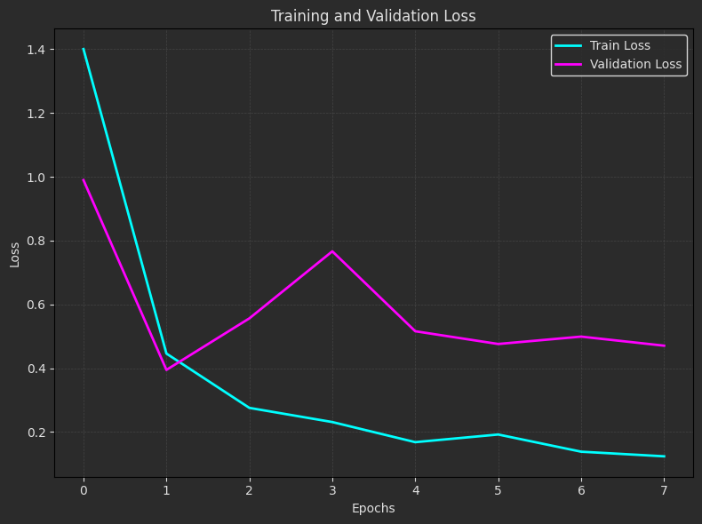

# Deep Learning and Image Classification

This repository contains two projects focusing on deep learning and image classification using Python:
1. **5 Animals Classification**: Train a CNN on a custom dataset to classify animals and produce fun emoji-based predictions.
2. **17 Flowers Classification**: Train and evaluate a CNN on flower species, including data augmentation and integration with a Telegram bot.


## Project 1: 5 Animals Classification

The goal of this project is to classify images from the **5 Animals** dataset. A Convolutional Neural Network (CNN) is trained to achieve high accuracy, and inference produces the name of corresponding to the animal classes.

### Steps
1. **Dataset**: The dataset contains 1,314 images organized into 5 folders, each corresponding to a specific animal category: `cat, dog, elephant, panda, and giraffe`. These images are carefully curated to ensure diversity within each class, making the dataset suitable for machine learning tasks such as classification, image recognition, or transfer learning.
2. **Model Training**: Trained a CNN using `TensorFlow/Keras` with a sequential architecture to classify images into five animal categories (cat, dog, elephant, panda, and giraffe). Below is the summary of the model:

- **Model**: "sequential"

  | **Layer (type)**      | **Output Shape**     | **Param #**    |
  |-----------------------|----------------------|----------------|
  | conv2d (Conv2D)       | (None, 222, 222, 32)| 896            |
  | conv2d_1 (Conv2D)     | (None, 220, 220, 64)| 18,496         |
  | max_pooling2d         | (None, 110, 110, 64)| 0              |
  | flatten (Flatten)     | (None, 774400)      | 0              |
  | dense (Dense)         | (None, 128)         | 99,123,328     |
  | dropout (Dropout)     | (None, 128)         | 0              |
  | dense_1 (Dense)       | (None, 5)           | 645            |

- **Total params**: 99,143,365 (378.20 MB)  
- **Trainable params**: 99,143,365 (378.20 MB)  
- **Non-trainable params**: 0 (0.00 B)

3. **Evaluation**: 
- **Confusion Matrix**:
Visualize the **confusion matrix** to assess model performance and identify classification results. The confusion matrix helps to understand where misclassifications occur and how well the model predicts each class.

   

- **Train and Validation Plots**:
Analyze the training process through plots of:
- **Loss**: Track the training and validation loss across epochs to identify convergence and overfitting issues.

   

- **Accuracy**: Visualize training and validation accuracy over epochs to measure the model's performance and generalization.

    

- **Evaluation Table**:

  | **Metric**       | **Training** | **Validation** |
  |-------------------|--------------|----------------|
  | **Accuracy**      | 90.15%       | 63.74%         |
  | **Loss**          | 0.2688       | 1.1628         |

  These evaluation metrics provide a detailed view of the model's overall performance during training and validation phases.

4. **Inference**:
   - Read an image.
   - Predict its class.
   - Print the corresponding animal.

---

## Project 2: 17 Flowers Classification

The goal of this project is to classify images from the **17Flowers** dataset. A Convolutional Neural Network (CNN) is trained to achieve high accuracy, augmented to improve performance, and connected to a Telegram bot for inference.

### Steps
1. **Dataset**: The dataset consists of 17 classes of flowers, with a total of 1020 training images and 340 test images. Each class represents a unique flower type, including: `bluebell, buttercup, coltsfoot, cowslip, crocus, daffodil, daisy, dandelion, fritillary, iris, lilyvalley, pansy, snowdrop, sunflower, tigerlily, tulip, windflower`. These images are carefully organized and balanced across all classes, ensuring diversity and reliability for machine learning tasks such as classification, image recognition, or transfer learning.

2. **Model Training**: Trained a CNN using `TensorFlow/Keras` with a sequential architecture to classify images into five animal categories (bluebell, buttercup, coltsfoot, cowslip, crocus, daffodil, daisy, dandelion, fritillary, iris, lilyvalley, pansy, snowdrop, sunflower, tigerlily, tulip, windflower). Below is the summary of the model:

- **Model**: "sequential"

  | **Layer (type)**      | **Output Shape**     | **Param #**    |
  |-----------------------|----------------------|----------------|
  | conv2d (Conv2D)       | (None, 224, 224, 32)| 896            |
  | max_pooling2d (MaxPooling2D)       | (None, 112, 112, 32)| 0        |
  | conv2d_1 (Conv2D)        | (None, 112, 112, 64)| 18,496              |
  | max_pooling2d_1 (MaxPooling2D) | (None, 56, 56, 64)| 0          |
  | conv2d_2 (Conv2D) | (None, 56, 56, 128)  | 73,856     |
  | max_pooling2d_2 (MaxPooling2D) | (None, 28, 28, 128)  | 0   |
  | flatten (Flatten)     | (None, 100352)      | 0              |
  | dense (Dense)         | (None, 128)         | 12,845,184      |
  | dropout (Dropout)     | (None, 128)         | 0              |
  | dense_1 (Dense)       | (None, 17)           | 2,193             |

- **Total params**: 38,821,877 (148.09 MB) 
- **Trainable params**: 12,940,625 (49.36 MB)  
- **Non-trainable params**: 0 (0.00 B)

3. **Evaluation**: 
- **Confusion Matrix**:
Visualize the **confusion matrix** to assess model performance and identify classification results. The confusion matrix helps to understand where misclassifications occur and how well the model predicts each class.

   

- **Train and Validation Plots**:
Analyze the training process through plots of:
- **Loss**: Track the training and validation loss across epochs to identify convergence and overfitting issues.

    

- **Accuracy**: Visualize training and validation accuracy over epochs to measure the model's performance and generalization.

   

- **Evaluation Table**:

  | **Metric**       | **Training** | **Validation** | **Test** |
  |-------------------|--------------|----------------|---------|
  | **Accuracy**      | 73.66%       | 59.39%         | 62.64%  |
  | **Loss**          | 0.8033       | 1.2250         | 1.221   |

  These evaluation metrics provide a detailed view of the model's overall performance during training and validation phases.

4. **Inference**:
   - Read an image.
   - Predict its class.
   - Print the corresponding animal.

5. **Telegram Bot Integration**:
   - Connect the trained model to a Telegram bot for inference. Users can send an image, and the bot will classify it into one of the 17 flower categories.


      


---

## How to Run the Code
1. Clone the repository:

   ```
   https://github.com/nakhani/Deep-Learning/tree/ff95d883b60e85e4b5e56b699110983c5d4882e4/CNN_2
   ```

2. Navigate to the directory:

   ```
   CNN_2
   ```

3. Install the required packages:
   ```sh
   pip install -r requirements.txt
   ```

4. Run the project:
  
   ```
   jupyter notebook 5animals.ipynb  # For training 5 Animals Dataset model and predict a new animal with CNN + MLP
   jupyter notebook 17flowers.ipynb    # For training 17 Flowers Dataset model and predict a new flower with CNN + MLP
   ```
   
---
## Technologies Used
- Python 3
- TensorFlow/Keras
- NumPy
- Pandas
- Matplotlib
- scikit-learn
