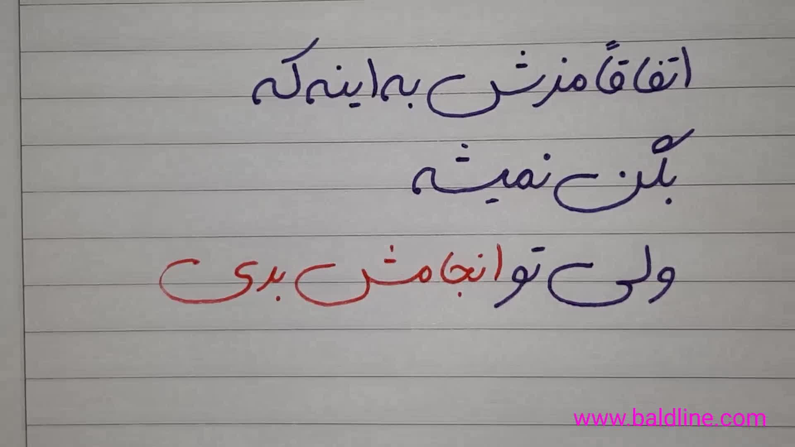
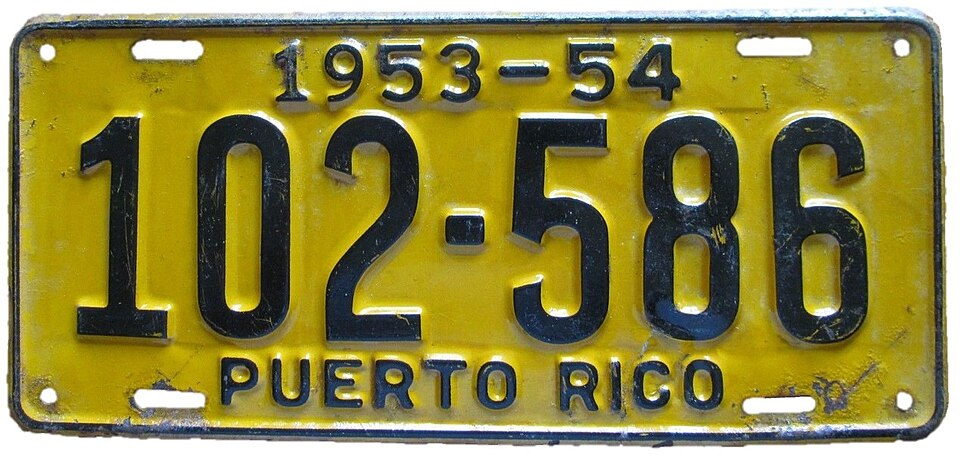
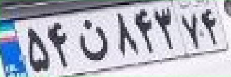
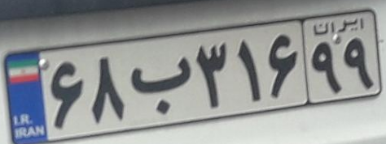
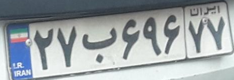
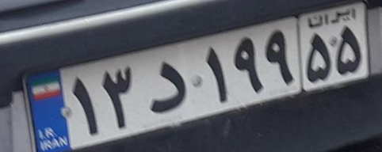

# EasyOCR & DTRB  

## 📌 Project Overview
This project utilizes **EasyOCR** for text recognition and **Deep Text Recognition Benchmark (DTRB)** for training and refining Persian license plate recognition models. The project includes dataset annotation, training on large-scale Persian license plate datasets, and model inference.  

---

##  EasyOCR Repository

### Installation  
Install **EasyOCR** package on your local machine.

### Usage

Run inference on different types of images:

- **Latin hand-writing text**

  

  | predicted_labels  | confidence score |
  |-------------|------------|
  | Soft | 0.75 |
  | Heavy | 0.99 |

- **Persian hand-writing text**

  

  | predicted_labels  | confidence score |
  |-------------|------------|
  | اتفاقاً مزخ بهاینم ك| 0.34 |
  | نمت | 0.98 |
  | ول توا نجامت بری | 0.47|
  | -_______---_ | 0.26 |
  | بثن | 0.87 |

- **Latin license plate**

  

  | predicted_labels  | confidence score |
  |-------------|------------|
  | 1953-54 | 0.90 |
  | 102.586 | 0.67 |
  | PUERTO | 0.91 |
  | Rico  | 0.94 |  

- **Persian license plate**

  

  | predicted_labels  | confidence score |
  |-------------|------------|
  | ٥٤ | 0.40 |
  | ٧٢ | 0.88 |
  | ٥٨٤٢ | 0.55 |

---

## Deep Text Recognition Benchmark (DTRB)

### Clone Repository

Clone the **DTRB** repository in Google Colab

   ```
   !git clone https://github.com/username/DTRB.git
   ```

### Download Pre-Trained Model

Select a **pre-trained model** and download it using **gdown**.

   ```
   !gdown --id your_pretrained_model_id
   ```

### Run Inference

Run inference on different types of images:

- **Latin hand-writing text**

  

  | predicted_labels  | confidence score |
  |-------------|------------|
  | Heavy | 0.049 |

- **Persian hand-writing text**

  

  | predicted_labels  | confidence score |
  |-------------|------------|
  | contanting | 0.00 |
 

- **Latin license plate**

  

  | predicted_labels  | confidence score |
  |-------------|------------|
  | 102586 | 0.56 |


- **Persian license plate**

  

  | predicted_labels  | confidence score |
  |-------------|------------|
  | spaffy | 0.00 |

---

## Fine-Tuning DTRB for Persian License Plate OCR Recognition

### 📌 License Plate Annotation

Use the following mapping for **YOLO-detected license plate annotation** in **DTRB format**:
 
   ```
    dict = {
     'A': 'الف', 'B': 'ب', 'P': 'پ', 'T': 'ت', 'Y': 'ث', 'Z': 'ز',
     'X': 'ش', 'E': 'ع', 'F': 'ف', 'K': 'ک', 'G': 'گ', 'D': 'D', 'S': 'S',
     'J': 'ج', 'W': 'د', 'C': 'س', 'U': 'ص', 'R': 'ط', 'Q': 'ق', 'L': 'ل',
     'M': 'م', 'N': 'ن', 'V': 'و', 'H': 'ه', 'I': 'ی',
     '0': '۰', '1': '۱', '2': '۲', '3': '۳', '4': '۴', '5': '۵', '6': '۶',
     '7': '۷', '8': '۸', '9': '۹', '@': 'ویلچر'
    }
   ```

### 📌 Model Training

- **Convert Dataset to DTRB Format**
- **Train Model**
- **Inference on Different Colored License Plates**


### 📌 Results

- **DTRB Model Performance**

  | Iteration |  Train Loss |  Validation Loss |
  |-------------|------------|-------------|
  | 1 | 3.65 | 3.52 |
  | 500 | 1.82 | 0.42 |
  | 1000 | 0.18 | 0.17 |
  | 1500 | 0.11 | 0.17 |
  | 2000 | 0.08 | 0.19 |
  | 2500 | 0.06 | 0.19 |
  | 3000 | 0.05 | 0.20 |
  | 3500 | 0.04 | 0.20 |
  | 4000 | 0.03 | 0.21 |
  | 4500 | 0.02 | 0.22 |


- **Testing on different Persian License Plates**

  |Image 1 | Image 2  | Image 3 | Image 4 | Image 5 |
  |-------------|------------|-------------|--------|---------|
  |  |  |  |  |  |


  |Image Number | predicted_labels  | confidence score |
  |-------------|------------|-------------|
  | 1 | 68b31699 | 0.99 |
  | 2 | 27b69677 | 0.99 |
  | 3 | 27i18823 | 0.07 |
  | 4 | 16a96222 | 0.37 |
  | 5 | 13w19955 | 0.98 |


### 📌 Resources

- **📥 Trained Weights**: [Download Here](https://drive.google.com/drive/folders/15WPsuPJDCzhp2SvYZLRj8mAlT3zmoAMW) 
- **📥 Dataset**: [Download Here](https://github.com/mut-deep/IR-LPR?tab=readme-ov-file) 

---

## How to Run the Code
1. Clone the repository:

   ```
   https://github.com/nakhani/Deep-Learning/tree/74320f3c90196359fc87da72e45b82cfac1a7d66/easyOCR_DTRB
   ```

2. Navigate to the directory:

   ```
   easyOCR_DTRB
   ```

3. Install the required packages:
   ```sh
   pip install -r requirements.txt
   ```

4. Run the project:
  
   ```
   jupyter notebook DTRB_demo.ipynb  # For testing DTBR on different Inputs with English and Persian Languages
   jupyter notebook persian_license_plate_train.ipynb  # For training persian license plates Dataset model and predict a new persian license plates with Deep Text Recognition Benchmark
   jupyter notebook test_easyocr.ipynb  # For testing EasyOCR on different Inputs with English and Persian Languages 

   ```
   
---
## Technologies Used
- Python 3
- EasyOCR
- NumPy
- gdown
- Matplotlib
- torch


